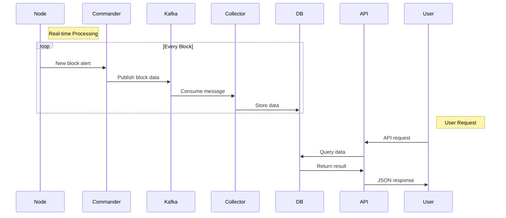

# 익스플로러 개발 후기

## 들어가며

새로운팀으로 배속되어서 익스플로러를 처음으로 a-z 까지 구현한 후기를 남겨볼까합니다.

### 익스플로러란 ? ([https://explorer.humanity.org/mainnet/overview](https://explorer.humanity.org/mainnet/overview))

쉽게 말해서 은행 거래내역서를 보여주는 웹 사이트라고 보면 좋을 것 같습니다.복잡한 블록체인 원장 데이터를 일반 사용자가 쉽게 이해할 수 있도록 시각화한 웹 서비스 입니다. 어떤 지갑의 코인 잔고현황, 전송내역등을 쉽고 빠르게 실시간으로 볼 수 있습니다. \
구현은 너무 훌륭한 회사 동료분 2분과 같이 약 1 달정도 작업을 했었습니다. 지난글 ([https://imjoongyeons-organization.gitbook.io/im/\~/revisions/fkTpeOUGry2JpaIUcGud/api/on-off](https://imjoongyeons-organization.gitbook.io/im/~/revisions/fkTpeOUGry2JpaIUcGud/api/on-off)) 에서 설명한 파이프라인을 사용해서 구현했습니다. 위 과정에 의해서 데이터를 가공해서 저장하면 서비스 API를 통해서 프론트엔드로 전달하는 과정만 추가됩니다.

## 기술 스택

스프링과 Kafka, Redis, MongoDB, ElasticSearch 사용했습니다.

## 개발 프로세스

이벤트 드리븐 아키텍처 입니다.

1. 블록 정보 수집용 노드 구성(인프라 요청)
2. 커맨더를 통해 최초 블럭정보 Kafka로 프로듀싱
3. 컬렉터를 통해 kafka로 부터 컨슈밍
4. 컨슘한 데이터를 후 가공 처리해서 DB에 적재
5. 서비스 애플리케이션에서 DB로부터 데이터 가져와서 가공하여 전달

## 개발하면서 어려웠던점

### 블록체인 도메인 지식 - 롤업

롤업이라고 블록체인에서는 레이어라는 개념이 존재하는데, 부모메인넷이있고 자식 메인넷이 있을때 자식 메인넷에서 발생한 트랜잭션묶음을 부모 트랜잭션에가서 증거를 남기는 과정을 롤업이라고 합니다. 롤업의 장점은 거래 수수료를 감소시킬 수 있으며, 한적한 자식서버에서 트랜잭션을 일으키면 복잡한 부모메인넷에서 직접 트랜잭션을 일으키는것 보다 더 빨리 처리됩니다. 또한 부모 메인넷에 증거를 남김으로써 부모 메인넷의 보안 안정성을 가져갈 수 있다는 장점이 있습니다.\
이번에 만든 익스플로러는 자식 메인넷이라고 생각하면 되는데요(레이어2) 롤업하는 과정과 롤업프로세스가 진행됨에 따라 상태를 표기해주어야하는 요구사항이 있었습니다.

우리 팀은 가장 먼저 롤업이 일어났을때 발생하는 이벤트를 조사했고, 그 다음으로 상태가 변함에 따라 어떤 이벤트들이 블 에 남는지를 조사했습니다.

조사한 내용을 토대로, 후 가공처리인 컬렉터에서 상태를 업데이트해주는 로직을 추가했습니다. \
롤업 상태 변화는 평균 지연시간 1분 미만으로 설정했으며, 30분에 한 번 나타나는 이벤트라 1분씩 체크하는 방식으로 했습니다.

### CI / CI 구성 - 헤더로 mainnet/testnet분기처리 - nginx

단일 도메인에서 메인넷과 테스트넷을 동시에 보여줘야하는 요구사항이 있었습니다.  서비스 API는 각각 띄워둔 상태이며, 헤더기반으로 Mainnet과 Testnet을 라우팅 해주었습니다. Nginx까지 직접 구성해본 건 처음이라 처음에는 해맸는데 기존에 다른 메인넷들 구성되어있는것을 하나 하나 따라해보면서 원리를 이해하면서 하다보니 적응할 수 있었고, 이 다음에 만든 익스플로러도 마찬가지로 직접 구성했습니다.

배포는 무중단을 원칙으로 헀으며, 젠킨스를 통해 구성된 파이프라인은 배포시작과 끝을 Slack알림으로 받아볼 수 있게 구성했습니다.

## 결과

개발할 때 약 1달이라는 시간이 정신없이 지나갔습니다.\
처리 성능은 초당 약 1000개 이상의 트랜잭션 처리가 가능하며, 무중단배포로 서비스 연속성을 보장할 수 있습니다.\
또한 비슷한 계열의 메인넷은 상속과 인터페이스 구현을 통해 단기간에 만들어낼 수 있는 기틀을 다졌습니다.

