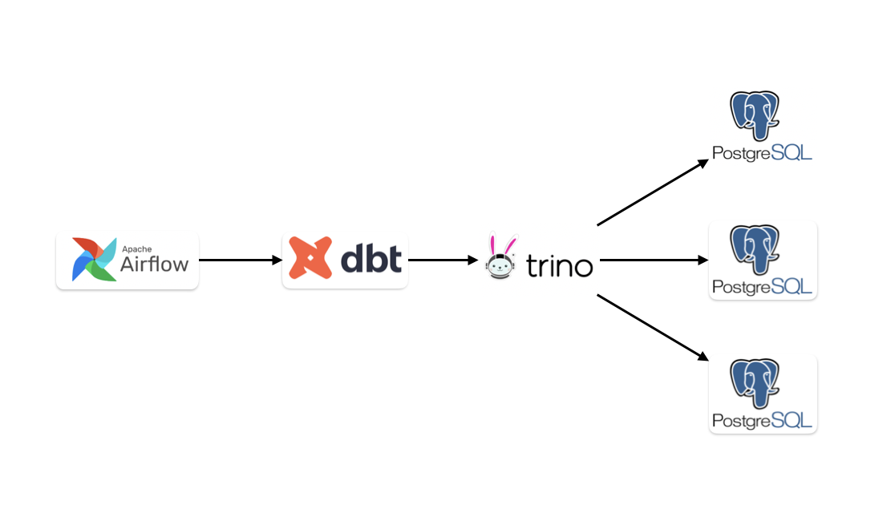

# 2. 어떻게 사용했는가

## 구조

### 파이프라인

원장데이터를 수집하는 파이프라인은 제가 기여한 부분이 없어서 제거했습니다.\
아래 파이프라인은 원장 데이터가 수집되어 Postgres에 들어있는 상태 이후의 파이프라인입니다.

<figure><figcaption></figcaption></figure>

각각의 Postgres를 분산해 놓은 이유는 각 메인넷별로 23년도 마이그레이션 할 때 기준 원장데이터의 크기 때문입니다.

|    | 메인넷       | 용량     |
| -- | --------- | ------ |
| 1  | Polygon   | 17 TB  |
| 2  | BSC       | 11 TB  |
| 3  | Avalanche | 8 TB   |
| 4  | Ethereum  | 7 TB   |
| 5  | Wemix     | 5.5 TB |
| 6  | Near      | 5 TB   |
| 7  | Klaytn    | 4.6 TB |
| 8  | Arbitrum  | 1.3 TB |
| 9  | Optimism  | 600 GB |
| 10 | Xpla      | 500 GB |

\*\* Trino는 물리적으로 분산된 Postgres들을 Join 시키기 위해 사용했습니다.

### DBT 레포

sql은 models아래에 위치하여야하며, 1개당 1개의 테이블이 생성됩니다.

schema.yml은 현재 레포의 sql모델들에 대한 명세를 제공하며, 하위 yml은 상위 yml을 덮어씁니다.

```
├── analysis
├── logs
├── macros                         -- 반복되는 로직을 따로 빼내서 관리
│       ├── custom_macro.sql
├── models
│   └── chain
│       ├── 체인_1.sql
│       ├── 체인_2.sql
│       └── schema.yml             -- 같은 디렉토리 내의 sql 모델의 메타정보를 명시(타입, 컬럼명 등)
│   └── token
│       ├── 토큰_1.sql
│       ├── 토큰_2.sql
│       └── schema.yml  
│   └── source
│       ├── 원천데이터_1.yml          -- dbt로 적재하지 않는 읽어올 원천데이터들의 메타정보를 명시
│       └── 원천데이터_2.yml
├── snapshots
├── tests
├── dbt_project.yml                -- 각 모델이 저장되는 데이터베이스 위치
└── profile.yml                    -- 환경설정, 데이터베이스 주소 등

```


## 사용법&#x20;

SQL 모델 예시&#x20;

```django
config(
    alias = 'pools',
    materialized = 'incremental',
    incremental_strategy = 'append',
    tags = ['airflow1',],
    )
}}

SELECT 'ethereum' AS blockchain
, 'defi-project' AS project
, 'v2' AS version
, trim(pair, '"') AS pool
, 0.3 AS fee
, token0
, token1
, evt_block_time AS creation_block_time
, evt_block_number AS creation_block_number
, contract_address
FROM {{ source('스키마', '테이블') }}

WHERE evt_block_time > (select max(creation_block_time) from {{this}})


UNION ALL

SELECT 'ethereum' AS blockchain
, 'defi-project' AS project
, 'v3' AS version
, trim(pool, '"') as pool
, fee
, token0
, token1
, evt_block_time AS creation_block_time
, evt_block_number AS creation_block_number
, contract_address
FROM {{ source('스키마', '테이블') }}

WHERE evt_block_time > (select max(creation_block_time) from {{this}})

```

config는 yml에 선언된 내용을 덮어쓰기할 수 있습니다.

```
alias = 'name' 
//데이터 베이스에 생성될 테이블명
```

```
materialized = 'incremental' or 'table'  
// incremental은 insert모드, table은 테이블을 truncate하고 전체 데이터 재생성
```

```
incremental_strategy = 'append' or 'merge'
//append는 기존 데이터는 건드리지말고 새 데이터만 추가. merge는 upsert인데 unique_key='' 키를 명시
```

```
source('스키마', '테이블') 
//읽어 올 테이블을 지정. yml파일에 명시된 스키마 구조로 인식
```

```


//if문 + is_incremental=> 첫 실행인지, 스케줄링 실행인지
```

### yml 파일 예시

```
version: 2

sources:
  - name: nft_project_eth
    database: ethereum
    schema: project_name_eth
    freshness:
      warn_after: { count: 12, period: hour }
      error_after: { count: 24, period: hour }
    tables:
      - name: function_call_atomicmatch_
        loaded_at_field: call_block_time
      - name: project_name_evt_ordersmatched
        loaded_at_field: evt_block_time
```

```
freshness:      
   warn_after: { count: 12, period: hour }  //마지막 데이터가 12시간 전이면 경고
   error_after: { count: 24, period: hour } //마지막데이터가 24시간 전이면 에러 발생
```

```
tables:
  - name: function_call_atomicmatch_ //테이블명
    loaded_at_field: call_block_time // 신선도 체크용 시간 컬럼
  - name: project_name_evt_ordersmatched //테이블명
    loaded_at_field: evt_block_time // 신선도 체크용 시간 컬럼
```

ex) 쿼리에서 사용하는법

```
FROM {{ source('nft_project_eth', 'function_call_atomicmatch_') }}
```

### 실행 명령어

신선도 검사

```
source venv/bin/activate && dbt source freshness 
```

실행

```
source venv/bin/activate && dbt run --select model명 또는 tag 등등
```

### DBT docs

모델간의 관계 파악을 위해 DBT docs를 사용합니다 (우측 그래프)

모델별로 정의된 칼럼의 자료형을 확인할 수 있습니다.

<figure><figcaption></figcaption></figure>

### 로그 모니터링 &#x20;

실행 및 모니터링은 airflow에서 관리 합니다.

<figure><figcaption></figcaption></figure>

Trino에서는 현재 동작중인 Dag의 실제 쿼리를 확인가능 합니다.

슬로우쿼리, 성능 모니터링은 Airflow보다 Trino에서 했었습니다.

<figure><figcaption></figcaption></figure>

### Airflow 사용 팁

airflow는 파이썬기반 작성된 코드이며 데이터베이스 접근,  API 호출 등이 가능합니다. 하지만 중간에 실패 할 수 있는 로직들이 껴있으면 복잡한 작업들은 권장되지 않습니다. 그래서 우리는 airflow는 Dag를 실행하는 용도로만 사용헀습니다.

