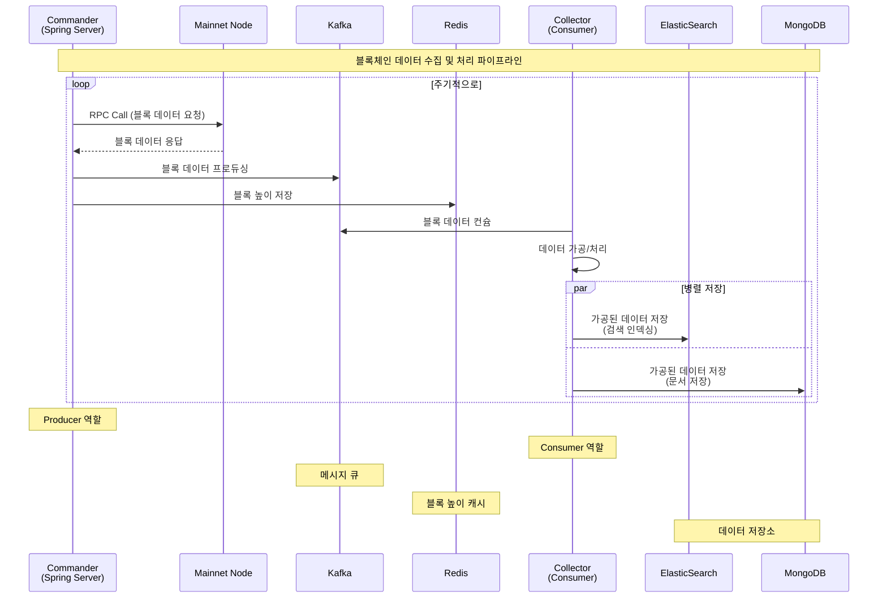

# 무중단 수집기 On/Off 처리 기능 추가

## 들어가며

\
블록체인 원장 데이터를 실시간으로 수집하는 스프링 프로세스가 있습니다. 이 프로세서의 핵심 역할은 Kafka에 수집된 블럭의 정보를 Kafka에 프로듀싱하고 수집이 완료된 원장데이터의 블럭 높이를 레디스에 저장하는 역할입니다. 우리 회사는 이 애플리케이션을 커맨더라고 불렀습니다.

Kafka에 블럭에 대한 정보를 프로듀싱하면 컨슈머는 후 가공프로세스를 진행합니다. 이 애플리케이션은 마찬가지로 스프링으로 이루어져있고 우리 회사는 컬렉터라고 불렀습니다.

## 요구사항

메인넷 노드가 하드포크 되어 재기동되어야하는 상황에서 커맨더가 메인넷 노드로 원장 데이터를 요청 하려고 하면 에러가 발생하기에 사용자가 원하는 런타임에 동적으로 잠시 멈춰야하는 기능이 필요했습니다.&#x20;

커맨더 서버 1대로 여러 메인넷들을 수집하고 있기 때문에 특정 메인넷만 프로듀싱하지 않도록 하고 싶었습니다.

## 해결방법

먼저 커맨더와 컬렉터 두 개의 관계에 대해서 생각을 해보았습니다.\
컬렉터는 프로듀싱되지 않으면 컨슈밍 할 데이터가 없으므로 프로듀싱만 되지 않으면 애플리케이션을 종료할 필요가 없다고 판단했습니다. 그래서 커맨더를 컨트롤 할 수 있다면, 컬렉터는 신경쓰지 않아도 되겠다는 생각이 들었습니다.

커맨더를 컨트롤하려고 보니, 각 메인넷별로 서비스가 이루어져있었습니다. 단순히 접근은 레디스나 DB쪽에서 다루는 것으로 접근했습니다.

먼저 필요한 기능을 정의해보니, 런타임에 동적으로 제어해야했고 AOP를 활용하여 MainnetStatusChecker라는 어노테이션을 만들어서 Redis 키에 따라서 실행직전 동작할지 말지를 판단하도록 구현하였습니다

AOP로 구현한 이유는 비지니스로직과 분리를 하고 싶었고, 기존 코드 수정을 최소화 하고 싶었습니다. 프록시 생성에 따른 약간의 오버헤드는 있지만 비정상적인 RPC 호출에 비하면 무시할 수 있는 수준이라고 판단했습니다. 결과적으로 전체 성능이 향상되고, 안정적으로 운영할 수 있었습니다.

## 마무리

구현을 하고보니, 결과적으로 봤을때 AOP하나 구현해서 서비스별로 추가한게 전부이지만, 너무 강력하고 필수적인 기능을 구현했다고 생각합니다. 데이터 파이프라인 관점에서 사용자가 원할때 On/Off하는 기능은 앞으로도 꾸준히 설계 할 때 생각하게 될 것 같습니다.\

\

