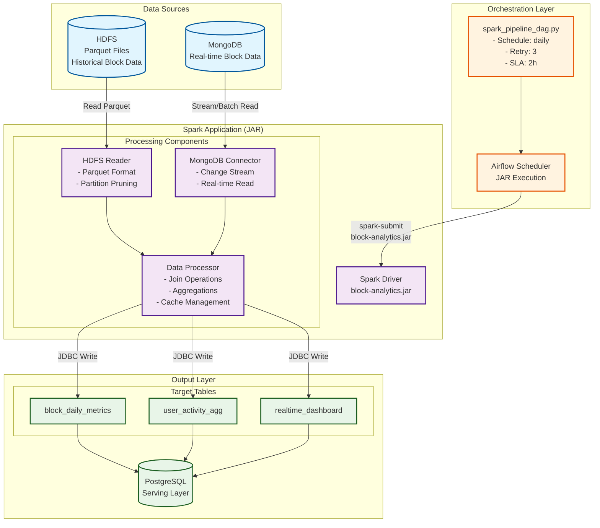

# 1. 계기

## 들어가며

지난 DBT + Airflow 마이그레이션 이후 잘 운영하고 있었습니다.\
하지만 회사에서 전사 차원으로 메인넷 원장을 필요로하는 다른 여러 팀이 생겨났습니다.\
그러다 데이터 플랫폼 팀이 신설되었고, 원장데이터를 HDFS로 관리하기로 결정되었습니다.

처음에는 DBT에 hive플러그인을 붙여서 계속 이어나가볼까 고민도해보고 실제로 POC도 했었습니다. 하지만 기존에 사용하던 트리노 서버 자원은 64GB RAM 워커 노드 4대 + 64GB RAM Master 노드 1대, 약 300GB 정도 되는 RAM을 Spark와 같이 운영하는것은 운영부담도되고, 굳이 2가지 대용량 처리 툴을 같이 가지고 갈 필요가 없었습니다.  따라서 DBT기반에서 Spark 기반으로 버리기로 결정났습니다.

이때부터는 신규지표를 개발하기보다는, 기존에 개발이 완료된 지표들에 대해서 스케줄링 운영 업무 위주로 돌아갔습니다. 회사 정규 프로그래밍언어가 자바였던점도 마이그레이션을 하는 이유였습니다.

지난 DBT로의 마이그레이션 이후 쿼리기반으로 개발하는 인력이 충원되지 않고 오히려 저 혼자 남아서 운영과 신규개발을 해야하는 상황이였는데, 이때 부터 신규개발보다는 기존에 개발된 지표를 운영하는 쪽으로 업무가 주어졌었습니다. 혼자 사유지보수해야하기도 했고, 회사에서 다른 모든 프로젝트에 Java를 쓰다보니,  파이썬의Jinja2를 고려할 필요도 없었습니다.

## 요구사항

우리팀은 이에 맞춰서 HDFS를 사용하도록 변경했어야했고, 기존의 원장데이터를 Postgres에서 HDFS에서 읽어오도록 변화시켜야 했습니다.

원장데이터를 저장하는데, 일(day) 단위로는 HDFS에 저장되고 (Parquet포맷) 나머지 00시부터 오늘 현재까지의 실시간 데이터는 SpeedLayer로 MongoDB에 저장되는 구조를 가졌습니다.

팀은 총 3명으로 2명은 원장데이터를 HDFS로 저장하고, 저의 역할은 HDFS와 MongoDB로부터 원장데이터를 읽어와서 가공하여 Postgres에 결과 데이터를 적재하는 업무를 맡았습니다.

Hadoop 및 스파크를 다룬 전문인원이 없었기 때문에 안정성을 최우선에두고 라이브러리 사용은 지양 ⇒ postgres, mongo connector정도만 사용했습니다.

메인넷별 일간 원장데이터는 parquet포맷으로 저장하기에 실시간으로 1개의 블럭당 1개의 파일을 만드는건 비효율적이였습니다. 우리는 1일 단위로 저장하기로했고, 나머지 실시간성데이터는 MongoDB에 2일 정도 TTL을 걸어서 저장해서 스피드레이어를 구성했습니다.

## 아키텍처

HDFS와 MongoDB로부터 원장데이터를 읽어서 가공해서 Postgres넣는 애플리케이션과

애플리케이션을 스케줄링하고 실행하며 모니터링하는 Airflow

