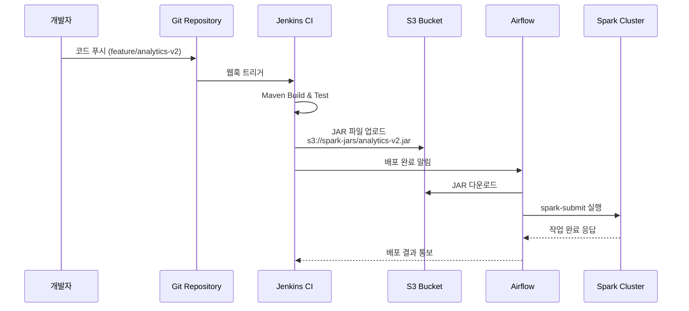

# 2. 어떻게 사용했는가


## POJO

스파크 3버전대를 사용했었는데, 스파크에맞는 안정화 자바 버전이 8이였습니다. 스프링은 붙일 수 없었습니다. 그래서 POJO로 한땀한땀 개발을 했습니다.

### 커맨드 인터페이스 개발

\
유연한 파라미터 처리를 위해 커스텀 Args Parser를 구현했습니다.

```sh
nohup spark-submit --master yarn --deploy-mode cluster --executor-cores 4 --num-executors 16 --executor-memory 3g --driver-memory 3g 
--name dp-analytics-ethereum-token_standard-test 
--packages org.mongodb.spark:mongo-spark-connector_2.12:3.0.0 
--class com.crossangle.analyticsairflow.AnalyticsAirflowApplication 
analytics-airflow-0.0.1-SNAPSHOT.jar 
production standard ethereum token_standard 2015-12-31 >> ./token_standard_test.log &
```

작업의 카테고리, 어떤 메인넷인지, 시작 날짜 정도 입력받도록 설정했습니다.


### 시작날짜로부터 원시데이터 Parquet + MongoDB 데이터 읽어오기

일(day) 단위 집게 작업이 주로 되어있다보니, 시작날짜로부터 Parquet을 읽어와서 MongoDB의 데이터와 Join하여 Dataset을 만들어내는것을 구현했습니다.

### 데이터프레임 동적 조인

데이터 가공이후 나온 결과물을 Postgres에 넣기 위해 비정규화된 데이터프레임들을 필드에따라서 자동으로 조인시키는 유틸 메서드도 직접구현해서 사용했습니다.

### 동적 필드 Upsert 구현

그리고 이렇게 만들어진 결과프레임을 기존의 테이블에 upsert하는데 동적으로 필드들이 채워지도록 메서드도 직접 구현해서 사용해습니다.


위의 몇 가지 단계들을 구현하고나니, 그 이후로는 거의 쿼리 최적화와, 정합성 검증 및 소요시간 과 리소스 할당에 따른 최적화가 관건이였습니다. 쿼리 최적화는 로그를 찍어보거나, UI통해서 실행되는 쿼리, 소모시간을 파악해서 병목걸리는 부분에 대해서 얼마나 소요되는지 체크했고, 읽어오는데가 문제인지, 쓰기가 문제인지, 집계가 문제인지를 파악해서 조치를 취했습니다.

## CI/CD

CI/CI는 조금 특이하게 했습니다. \
젠킨스에서 특정 브랜치의 Jar파일을 생성해서 S3버킷에 올리면, Airflow에서 S3에 올라가있는 Jar파일을 다운로드해서 미리 입력된 명령어들(위에서 본 예시) Dag에서 실행하도록 했습니다.



## 힘들었던 부분

수백개의 쿼리, 테이블을 마이그레이션 하다보니 제대로 동작하는지 확인하기 위해서 똑같은 테이블을 과거부터 다시 쌓는 과정이 필요했습니다. 그렇게 두 세트를 쌓아서 데이터를 비교한 후에야 하나의 쿼리가 마이그레이션 되었다고 볼 수 있습니다.&#x20;

서로 다른 두 개의 데이터소스를 불러와서 하나의 데이터프레임으로 합치는 작업은 노가다였습니다. 지금은 아마도 AI통해서 필드만 정의 잘 해주면 편하지 않을까 생각해봅니다.


